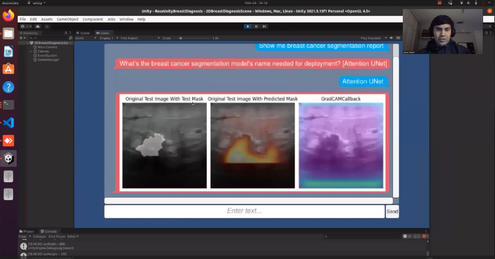
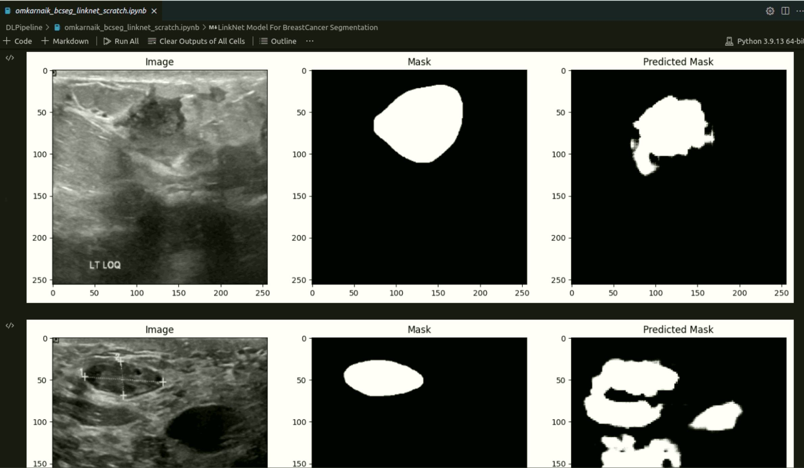
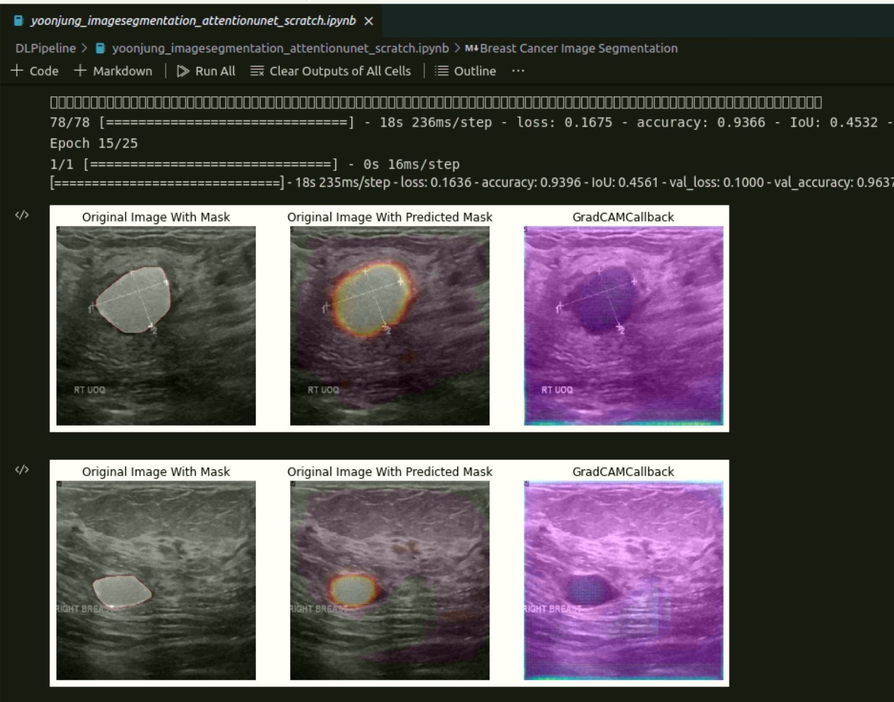
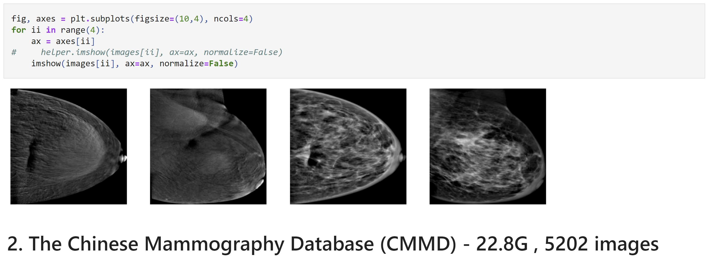
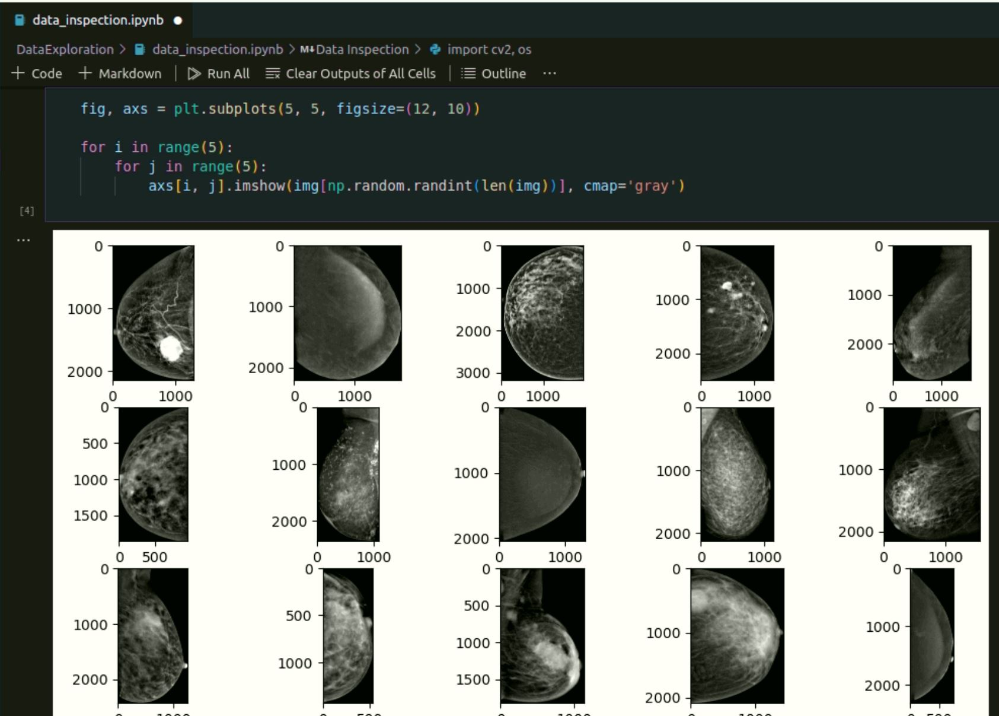
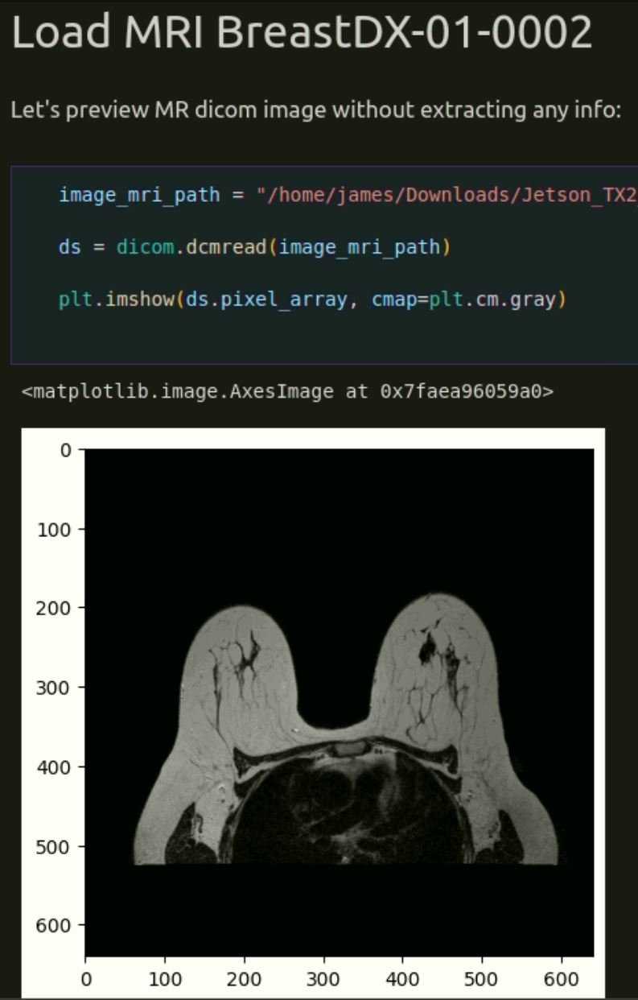

# Breast Cancer Segmentation

Lesion segmentation for breast cancer diagnosis.

## CMPE 258 Project Submission Checklist

- [x] 4\. Ten minutes presentation and program demo:

    - [x] (4.1) PPT (up to 5-7 slides) for 5-7 minutes presentation;
    - [x] (4.2) Demo, 1 minute;
    - [x] (4.3) Code walk-through for 1-2 minutes;
    - [ ] (4.4) Q&A, 1 minute.

- [x] 5\. Save up to 20 ~ 50 seconds demo video into a file for submission.
- [x] 6. Submit:

    - [x] a. Executive Summary;
    - [x] b. PPT;
    - [x] c. Your saved video clip;
    - [x] d. The program package (source code and all relevant files and folders);
    - [x] e. A readme file. Be sure detailed adequate information is provided for testing and verification purpose.

- [x] 7. Put all the above files into one file and zip it.
- [x] 8. Use the following file naming convention for your zip file:

    - [x] firstNamePerson1_firstNamePerson2_FirstNamePerson3_FirstNamePerson4_CoordinatorSID(last-4-digits)_cmpe258_team.zip.
    - [x] Ex: `Yoonjun_Choi_Omkar_Suryakant_Naik_Archil_Beridze_James_Medel_6649_cmpe258_team.zip`

- [x] Submit it to the class canvas.

## Outline

- Software Dependencies
- Setup Software Dev Environment
- How to Run Unity Rasa Breast Diagnosis Demo
    - Run Rasa Breast Cancer Diagnosis Chatbot + Actions Servers Natively
    - Run Unity Breast Diagnosis Chat Window App
- How to Run Python Breast Diagnosis Demo
    - Run Python Training Script
    - Run Python Deploy Script
- Notebooks
    - Data Exploration
    - DL Pipeline

## Software Dependencies

Here are some of the software dependencies:

- Rasa 3.2.4 (Rasa Chatbot Server)
- Rasa SDK 3.2.2 (Rasa Actions Server)
- TensorFlow-GPU 2.7.1 (Needed for Rasa Actions Server)
- Torch 1.13.0 (Needed for Rasa Actions Server)
- OpenCV-Python 4.6.0.66 (Needed for Rasa Actions Server)
- Scikit-Learn 0.24.2
- Seaborn 0.11.2
- Matplotlib 3.3.4
- Jupyter 1.0.0

Check out our conda environments that come with all the software dependencies and extra:

- [environments/attent_unet_env/gpu/environment_rasa_tf_gpu.yml](./environments/attent_unet_env/gpu/environment_rasa_tf_gpu.yml)
    - The environment yml file above is used with **rasa actions server**.
    - Recommend using the above environment yml for training models as long as you have gpu.
- [environments/attent_unet_env/cpu/environment_rasa_tf_cpu.yml](./environments/attent_unet_env/cpu/environment_rasa_tf_cpu.yml)
    - The environment yml file above is used with **rasa run server**.

## Setup Software Dev Environment

1\. Clone this repo:

~~~bash
git clone https://github.com/AI-Medical-Robotics/Breast-Cancer-Segmentation.git

# navigate to breast cancer segmentation
cd path/to/Breast-Cancer-Segmentation
~~~

2\. Download the Ultrasound Breast Cancer Segmentation Dataset:

- Kaggle Breast Cancer Ultrasound Dataset: https://www.kaggle.com/datasets/aryashah2k/breast-ultrasound-images-dataset

~~~bash
# Example: saved Ultrasound Dataset "Dataset_BUSI_with_GT" along this path
'/media/james/My Passport/Jetson_TX2_CMPE258/Dataset_BUSI_with_GT/'

# Make sure to save your Kaggle Ultrasound Dataset to  a place where the python scripts can find it.
~~~

3\. Create a `environment_rasa_tf_cpu.yml` conda environment:

~~~bash
cd environments/attent_unet_env/cpu/
conda env create -f environment_rasa_tf_cpu.yml
~~~

4\. Create a `environment_rasa_tf_gpu.yml` conda environment:

~~~bash
environments/attent_unet_env/gpu/
conda env create -f environment_rasa_tf_gpu.yml
~~~

## How to Run Unity Rasa Breast Diagnosis Demo

### Run Rasa Breast Cancer Diagnosis Chatbot + Actions Servers Natively

1\. **Open a terminal**, activate rasa cpu conda environment for **rasa run server**:

~~~bash
conda activate cmpe258_proj_attunet_rasa_tf_cpu
~~~

2\. Train the Rasa chatbot:

~~~bash
cd diagnosis_va/
rasa train --domain domain.yml --data data --out models
~~~

- NOTE: If you just cloned this repo, on a fresh environment, you will need to train Rasa chatbot 

3\. Run rasa chatbot run server:

~~~bash
cd diagnosis_va/
rasa run
~~~

4\. **Open a new terminal**, activate rasa gpu conda environment for **rasa run actions server**:

~~~bash
conda activate cmpe258_proj_attunet_rasa_tf_gpu
~~~

5\. Run rasa actions server:

~~~bash
cd path/to/Breast-Cancer-Segmentation/diagnosis_va/actions
rasa run actions
~~~

### Run Unity Breast Diagnosis Chat Window App

The Unity breast diagnosis chat window app integrates with Rasa Chatbot run server through the **rasa_url**.

1\. If you don't have **Unity Hub**, we recommend installing it at this link:

- [Download Unity Hub](https://unity3d.com/get-unity/download)

2\. Once you have Unity Hub installed, open it and then you can **add** the project. You just need to point Unity Hub to your project folder. In our case, **RasaUnityBreastDiagnosis/**.

- NOTE: We recommend through Unity Hub, you install **Unity Version: 2021.3.13f1**, but if not available, you can install the next LTS version and then load our app. Unity will update the project's assets to the latest version.

3\. The Unity project should be open, then you can click the **play** button in the center and the **RasaUnityBreastDiagnosis** App will start.

## How to Run Python Breast Diagnosis Demo

You can also run parts of the application through python scripts directly. We recommend you activate conda rasa gpu environment, but we wont use rasa part just the TensorFlow and other helper dependencies. 

~~~bash
conda activate cmpe258_proj_attunet_rasa_tf_gpu
~~~

Then go to `src/` folder.

~~~bash
cd path/to/Breast-Cancer-Segmentation/src
~~~

### Run Python Training Script

~~~bash
python train.py
~~~

### Run Python Deploy Script

~~~bash
python deploy.py
~~~

## Notebooks

### DL Pipeline

Omkar's LinkNet Breast Cancer Segmentation Notebook:

- [Omkar's Notebook: LinkNet Model for Breast Cancer Segmentation](./DLPipeline/omkarnaik_bcseg_linknet_scratch.ipynb)

Yoonjung's Attention UNet Breast Cancer Segmentation Notebook:

- [Yoonjung's Notebook: Attention UNet for Breast Cancer Segmentation](./DLPipeline/yoonjung_imagesegmentation_attentionunet_scratch.ipynb)

### Data Exploration

Here are just some examples of our data exploration notebooks.

Yoonjungs Data Exploration Notebook on Chinese Breast Cancer Mammograms:

- [Yoonjungs Notebook: DataExploration](./DataExploration/DataExplorationCMMD.ipynb)

Archil's Data Inspection & ResNet Notebook on Breast Cancer Mammograms:

- [Archils Notebook: DataInspection](./DataExploration/data_inspection.ipynb)

James Data Exploration Notebook on Breast Cancer Diagnosis MRIs:

- [James Notebook: DataExploration](./DataExploration/DataExplorationTciaBD.ipynb)

